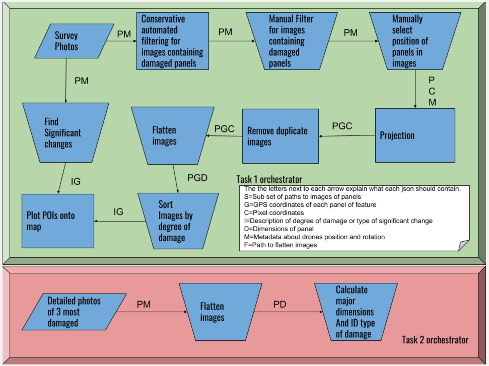

Orchestrator
---
# Description
This is the orchestration GUI that will be running all of the modules for task 1. 

The orchestrator will unlock buttons for different modules depending on where the last part of the workflow that has been completed.

# Parallel Operation
While only 1 instance of each module should be running, the orchestrator itself can be open on multiple computers as long as they are opened from the same directory on one machine (for example - network drive). One machine can be working on one branch of the workflow while the other computer can be working on the other branch.

# Workflow

# Prerequisites
- Python 3
- PyQT5

**NOTICE: This has only been tested on Mac and Debian based systems**

# Usage
`python orchestrator.py`
